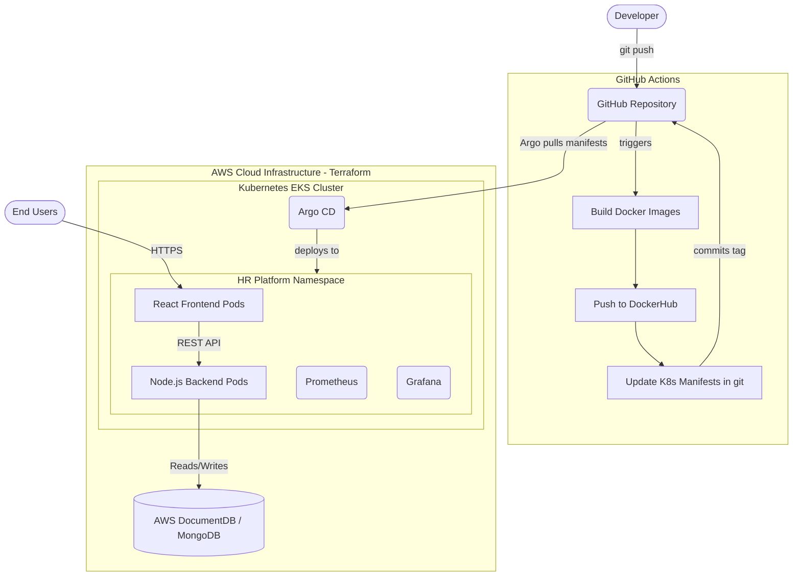

# 🚀 Enterprise HR Management Platform (Cloud-Native)

Welcome to the HR Employee Management System! This repository demonstrates a complete, production-grade **Enterprise DevOps Architecture** built from the ground up. It takes a modern MERN stack application and deploys it using strict GitOps principles, Infrastructure as Code, and Cloud-Native best practices on AWS (or local Kubernetes clusters).

## 🏗️ Architecture Diagram



---

## 📂 Deep Dive: Repository Structure & Usage

This repository strictly follows the Enterprise standard folder structure for separating concerns. Every file has a specific purpose in the DevOps lifecycle.

### 1. `app/` (Developer Code)
Contains the raw source code written by Software Engineers.
*   `app/frontend/`: React application. Contains its own `Dockerfile` optimized with NGINX.
*   `app/server/`: Node.js Express API. Contains its own `Dockerfile` for backend logic.

### 2. `terraform/` (Infrastructure as Code)
Used by DevOps Engineers to automatically provision physical hardware and networks in AWS. It uses a **Custom Modular Architecture** to ensure maximum security.
*   `main.tf`: The Root Module. Connects the VPC, EKS, IAM, and RDS modules together.
*   `modules/vpc/`: Builds the Virtual Private Cloud, Public Subnets, and Private Subnets.
*   `modules/iam/`: Creates strict AWS IAM Security Roles & Managed Policies.
*   `modules/eks/`: Provisions the Kubernetes Master Control Plane and EC2 Worker Nodes.
*   `modules/rds/`: Provisions the managed DocumentDB (MongoDB) cluster.

### 3. `k8s/` (Kubernetes Manifests & Overlays)
Read by **Argo CD** to deploy the application into the cluster. We use **Kustomize** to avoid repeating code.
*   `k8s/base/`: The core instructions (`Deployment`, `Service`, `PVC`) shared across all environments.
*   `k8s/overlays/dev/`: Developer environment (1 Replica) for testing.
*   `k8s/overlays/staging/`: QA environment (2 Replicas) for bug hunting.
*   `k8s/overlays/prod/`: Customer environment (3 Replicas) for High Availability.

### 4. `.github/` (Continuous Integration)
Used by **GitHub's Servers** to automate the build process.
*   `workflows/ci.yml`: The pipeline that triggers on `git push`. It builds the Docker images for both Frontend and Backend, pushes them to DockerHub, and automatically uses `sed` to update the Kubernetes manifests in `k8s/base/`.

### 5. `ansible/` (Server Configuration Management)
Used by DevOps Engineers to bootstrap servers via SSH.
*   `inventory/*.ini`: Lists the IP addresses of servers in `dev`, `staging`, and `prod`.
*   `playbooks/setup-bastion.yml`: Installs tools (Docker, AWS CLI, Kubectl) on jump-boxes.
*   `playbooks/setup-eks.yml`: Bootstraps the new EKS cluster by installing Helm and Argo CD.

### 6. `monitoring/` & `chaos/` (Observability & Resilience)
*   `monitoring/`: Deploys **Prometheus** (to scrape CPU metrics) and **Grafana** (dashboards) into the cluster.
*   `monitoring/grafana-dashboard-configmap.yaml`: Pre-built JSON dashboard to graph Frontend performance.
*   `chaos/pod-delete-experiment.yaml`: A **Litmus Chaos** script that intentionally murders Pods every 10 seconds to prove the cluster automatically heals itself without customer downtime.

---

## ⚙️ The GitOps Pipeline Workflow

This project uses a modern **GitOps** deployment model, abandoning legacy push-based deployments.

1.  **Code Commit:** A developer pushes code to the `main` branch.
2.  **Continuous Integration:** GitHub Actions automatically builds the new Docker images, pushes them to DockerHub, and updates the image tags in the `k8s/base` folder via a Git commit.
3.  **Continuous Deployment:** **Argo CD**, running securely inside the Kubernetes cluster, detects the file change in this GitHub repository and automatically pulls the new deployment state into the live cluster. *GitHub never has access to the AWS credentials.*

---

## 🚀 Getting Started

### 1. Build the Infrastructure (AWS)
```bash
cd terraform/
terraform init
terraform apply
```

### 2. Bootstrap the Cluster
```bash
cd ansible/
ansible-playbook -i inventory/production.ini playbooks/setup-eks.yml
```

### 3. Deploy the Application via GitOps
Point Argo CD to the specific environment overlay you wish to use:
*   `k8s/overlays/dev/`
*   `k8s/overlays/staging/`
*   `k8s/overlays/prod/`

---
*Built with ❤️ and DevOps best practices.*
